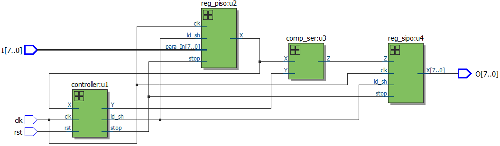

Complementador
==============

## Complementador a 2 de 8 bits

### Input  A: 8 bits number
### Output B: A 2-complement

Despite the fact that it is possible to specify this circuit as a big
combinational design, it becomes quite cumbersome as the number of bits
increases, thus by taking the structural approach we can guarantee an easy
to manage and scalable system which makes it relatively straightforward to
modify for a bigger number of bits however, the real main reason for this
project is to grasp the workflow of an ASM and the general steps in structural
design which includes registers and Control Units Block.

Project for starting to learn structural Design in VHDL

#### The proyect contains:

* 1 Top file (complementador.vhd)
* 2 Registers (reg_piso.vhd, reg_sipo.vhd)
* 1 Control Unit (controller.vhd)
* 1 Combinational Circuit (comp_ser.vhd)

#### Main workflow idea:
the algorithm finds the first "1" starting from its lsb, and then negates
(complements) the bits at the left of it.
